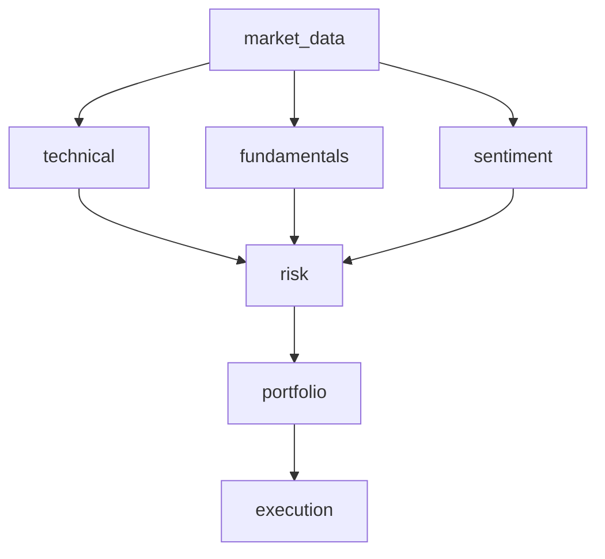

# Multi-Agent Daily Trading Demo

> Status: ✅ Ready for local testing  •  ⚠️ Not production-ready

| Component | Status |
|---|---:|
| Core demo script (`agentcore.py`) | ✅ tested locally |
| README & docs | ✅ complete |
| Requirements file | ✅ added |
| CI / Container | ⚪ not added |

This repository contains a small educational multi-agent trading workflow implemented in `agentcore.py`. It uses a Strands-style multi-agent graph where each agent runs a single tool (pure Python functions) to fetch market data, compute signals, combine risk logic, build a portfolio plan, and produce execution orders (stub).

**Purpose**: demonstrate how to orchestrate multiple agents/tools for a daily (EOD) trading workflow for two symbols (AAPL, GOOGL). Not production-ready — intended for learning and prototyping.

**Disclaimer**: This example is for educational purposes only and is not financial advice.

**File:** `agentcore.py`

**Main Concepts**
- **Tools:** Lightweight functions decorated with `@tool` that accept a `ToolContext` and read/write shared `invocation_state` to exchange data between nodes.
- **Agents:** Each `Agent` wraps a tool and (optionally) a model id. Agents are assembled into a graph for orchestration.
- **Graph:** `GraphBuilder` wires agents together with edges and optional conditions. Execution runs the graph from an entry point and returns a status.

Key tools implemented:
- `fetch_daily_closes` — downloads historical daily closes (via `yfinance`) and stores a DataFrame under `invocation_state['closes_df']`.
- `compute_technical_signals` — computes SMA20, SMA50, RSI14 and a simple momentum signal per symbol.
- `compute_fundamentals_bias` — placeholder returning a neutral fundamentals bias.
- `compute_sentiment_bias` — very simple proxy sentiment by 5-day returns.
- `risk_gatekeeper` — combines tech/fund/sent scores, applies risk sizing (volatility-based) and approves candidate trades.
- `build_portfolio_plan` — allocates capital to approved trades and constructs an order list.
- `execute_trades_stub` — prints orders to stdout (replace with broker API integration in production).

How the graph flows (simplified):

market_data
  ↓
  ├─> technical
  ├─> fundamentals
  └─> sentiment
     ↓
     (wait for all) → risk → portfolio → execution

Mermaid flow (rendered where supported):



Prerequisites
- **Python**: 3.10+ (3.11 recommended)
- **Pip packages**: `numpy`, `pandas`, `yfinance`, `strands` (project-specific)
- The project includes `requirements.txt` for quick setup.

Install dependencies (example):
```bash
python -m venv .venv
source .venv/bin/activate    # bash / macOS
pip install --upgrade pip
pip install numpy pandas yfinance
# Install your internal Strands package as appropriate
```

Running the demo (quick)

1. Create and activate a virtualenv, install requirements:

```bash
python -m venv .venv
source .venv/bin/activate   # or `.venv\Scripts\activate` on Windows
pip install -r requirements.txt
```

2. (Optional) Set AWS model environment if using LLM backends (Bedrock):

PowerShell example:
```powershell
$env:AWS_PROFILE='your_profile'
$env:AWS_REGION='eu-central-1'
```

Bash example:
```bash
export AWS_PROFILE=your_profile
export AWS_REGION=eu-central-1
```

3. Run the script:

```bash
python agentcore.py
```

Output
- The run prints a final graph status and a final trade plan JSON. The execution stub prints orders to stdout.

Configuration
- Shared state keys (in `main()`):
  - `symbols`: list of ticker symbols (default `['AAPL','GOOGL']`)
  - `lookback_days`: lookback window for indicators (default `200`)
  - `capital`, `max_position_pct`, `target_risk_pct`, `min_score`, `long_only`

Customization & Extension
- Replace `execute_trades_stub` to call a broker API for live trading.
- Replace `compute_fundamentals_bias` and `compute_sentiment_bias` with services (news LLMs, fundamentals feeds).
- Add more advanced risk models and position-sizing logic.
- Plug in a Bedrock or other LLM model by passing `model_id` into `make_agents(model_id=...)` to run agent reasoning on a model.

Project checklist & next tasks

- [x] Code explanation and architecture notes
- [x] `README.md` with usage and configuration
- [x] `requirements.txt` added
- [ ] Add unit tests for tools (`pytest`)
- [ ] Add CI workflow (GitHub Actions) with JDK/Python matrix if needed
- [ ] Containerize demo (`Dockerfile`) for reproducible CI runs

Quick commands for testing 

```bash
# run unit tests (after adding tests) 
pytest -q

# run script locally
python agentcore.py  
```
 
Security & Safety
- This example intentionally prints orders — do not enable live execution without proper authentication and safeguards.  